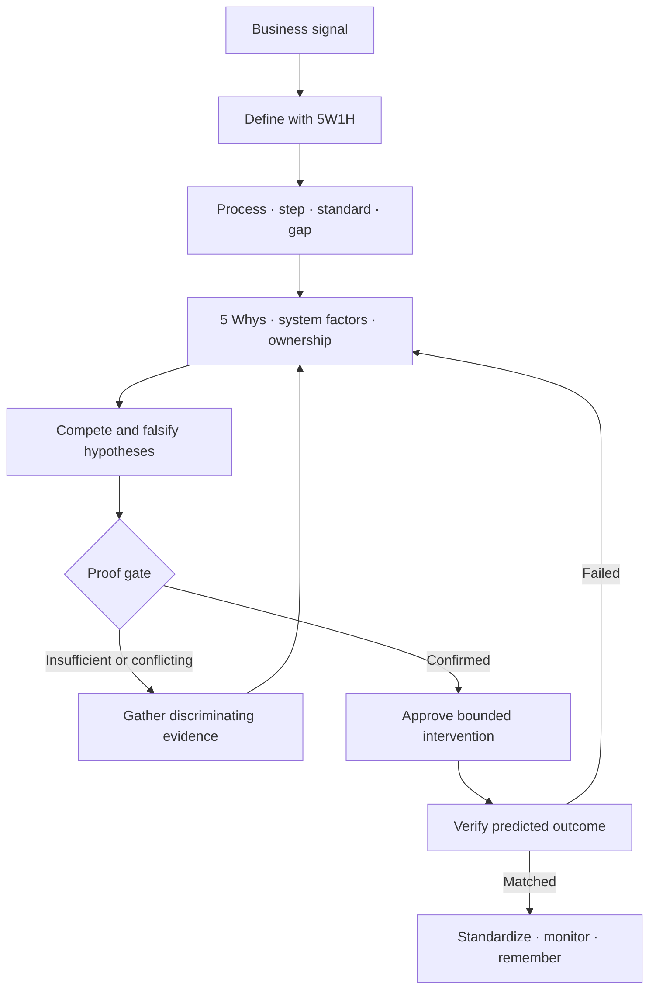
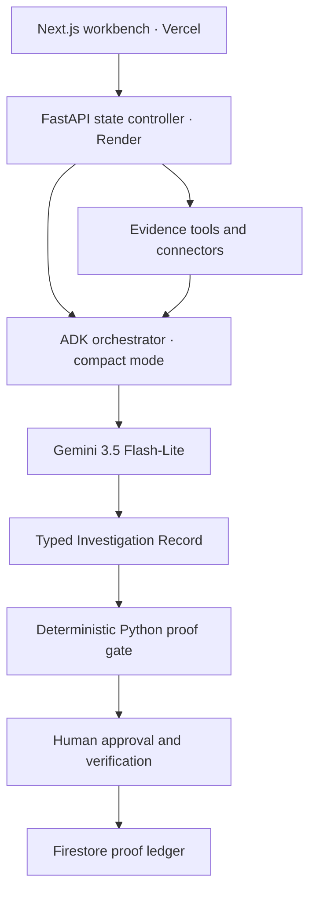

# ProofLoop decision architecture

ProofLoop is an autonomous business investigation engine. It does not stop at
finding an anomaly or producing advice. It maintains a falsifiable investigation
until the evidence supports an action, then verifies the result and turns the
outcome into an operating standard.

## Canonical decision loop



The diagnostic backbone is:

`Problem → Process → Step → Standard → Gap → 5 Whys → System Factors → Ownership → Corrective Action → Verification → Standardization → Monitoring`

## Runtime architecture



The hosted path uses one schema-constrained ADK orchestrator call. This follows
the architecture of one orchestrator plus deterministic state transitions and
specialized tools; it avoids a fragile swarm of agents. The six-agent sequential
workflow remains available as an evaluation mode, not the primary production
path.

## Investigation state contract

Every run stores:

```text
Incident
├── 5W1H frame and business impact
├── process_gap
│   ├── process
│   ├── failing_step
│   ├── expected_standard
│   ├── actual_execution
│   └── gap
├── five_whys[]
├── system_factors[]
│   └── people · process · technology · inputs
│       environment · measurement · incentives
├── ownership
│   └── technical · operational · execution · quality · approver
├── quality_escape and incentive_alignment
├── hypotheses[]
│   └── mechanism · supporting/contradicting evidence
│       missing evidence · discriminating test · evidence state
├── root_problem
├── intervention and locked measurement contract
└── investigation termination state
```

The three operating comparisons are explicit:

| Contract | Question |
|---|---|
| Standard | What should have happened? |
| Evidence | What actually happened? |
| Verification | How will correctness be proven? |

## State machine and stopping rules

Pre-action termination states:

| State | Meaning | Allowed transition |
|---|---|---|
| `confirmed` | A supported, controllable cause passed the proof gate | Request human approval |
| `insufficient_evidence` | Important evidence is absent | Gather a named missing observation |
| `conflicting_evidence` | Credible hypotheses cannot be separated | Run the cheapest discriminating test |

After intervention, `intervention_validated` is allowed only when the predicted
metric moves in the predicted direction and guardrails pass.

The Python service independently enforces:

- at least two independent evidence sources;
- three to five materially different hypotheses;
- at least one supported hypothesis;
- a supported Root Problem Record;
- a human-approval requirement before action;
- maximum four investigation rounds, twenty tool calls, and five hypotheses.

Gemini may recommend a transition, but it cannot bypass this gate.

## Operating-system diagnosis

ProofLoop looks beyond software symptoms across seven modern business factors:

| Domain | Examples |
|---|---|
| People | Skills, capacity, training, communication |
| Process | Workflow, handoffs, SOPs, approvals |
| Technology | Software, APIs, infrastructure, automation |
| Inputs | Data, traffic, requirements, customer mix |
| Environment | Market, regulation, competition, operating conditions |
| Measurement | Instrumentation, definitions, reporting quality |
| Incentives | KPIs, speed/quality tradeoffs, performance pressure |

Ownership is separated into technical owner, operational owner, executor,
quality owner, and decision approver. This lets the system detect missing
accountability, responsibility without authority, and unowned quality controls.

## Closure and organizational memory

The intervention contract is locked before approval: scope, reversibility,
primary metric, success threshold, observation window, guardrails, and stop
condition. Evaluation writes the outcome plus a standardization record:

`Incident → Cause → Action → Outcome → Updated standard → Monitoring rule`

Firestore collections:

- `diagnostic_runs`: evidence, investigation state, hypotheses, and decision;
- `interventions`: scoped human authorization and idempotency record;
- `proof_records`: measured outcome, learned rule, updated control, and recurrence monitor.

## Safety and failure boundaries

- The initial signal is never called the root problem.
- Unsupported standards, owners, incentives, or causal links are marked unknown.
- Evidence-state labels replace arbitrary confidence percentages.
- Gemini capacity errors return retryable `503` responses; the system does not fabricate a diagnosis.
- Invalid structured output fails closed.
- Consequential actions require human approval.
- Credentials remain in runtime secrets and never enter prompts or repository state.

## Hackathon scope

The architecture understands broader organizational causes, but the demo proves
one end-to-end revenue incident using synthetic Google Ads-, Looker-, release-,
quality-, and customer-voice-shaped evidence. The judge-facing proof is the full
loop: diagnose the actual process failure, approve a bounded rollback, verify the
metric recovery, update the release standard, and persist the learned rule.
