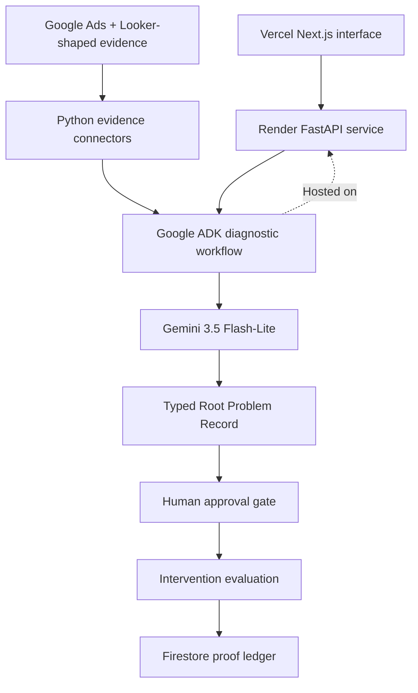
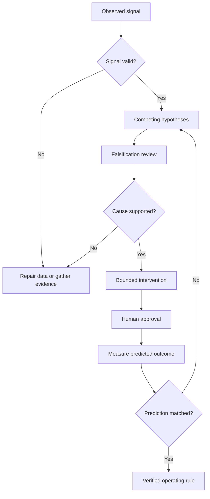

# ProofLoop architecture

## Responsibilities

| Layer | Responsibility |
|---|---|
| Next.js on Vercel | Presents the six-stage diagnostic workbench and calls the agent API |
| FastAPI | Validates requests and exposes diagnosis, approval, and evaluation endpoints |
| ADK | Runs the six-stage proof contract in one hosted model call; the full sequential-agent mode remains available |
| Gemini | Synthesizes evidence, competes hypotheses, falsifies explanations, and produces typed decisions |
| Connectors | Load source-labelled evidence without exposing credentials to prompts |
| Pydantic schemas | Enforce Root Problem Record and intervention contracts |
| Firestore | Persists diagnostic runs, approvals, proof records, and learned rules |
| Render | Hosts the Dockerized Python API and ADK workflow |

## Structured agent contract

The model is not allowed to return an unstructured recommendation. The hosted ADK agent applies all six proof gates and returns a Pydantic-validated `DiagnosticDecision` containing a `RootProblemRecord`, an `InterventionPlan`, the next decision gate, and a plain-language summary. Compact mode uses one model call for demo reliability; sequential mode retains the six specialized agents for deeper evaluation. `/v1/model` publishes the exact JSON schemas used by the application, and the Vercel interface renders the returned fields rather than replacing them with generated prose.

## Proof gate

## Data boundaries

- Demo mode loads only `data/incident-pl0047.json`.
- Live connector secrets are read from runtime environment variables.
- Source rows remain outside persistent ADK instructions unless explicitly selected as evidence.
- Every evidence-backed conclusion carries source IDs and reliability labels.
- Firestore writes use a least-privilege service-account credential stored only in Render's secret environment.

## Failure handling

- Gemini capacity errors are returned as retryable API responses rather than fabricated diagnoses.
- Missing or malformed final JSON fails closed.
- Intervention approval requires explicit scope acknowledgement.
- Approval records include idempotency keys.
- Evaluation metrics and stop conditions are locked before intervention execution.
