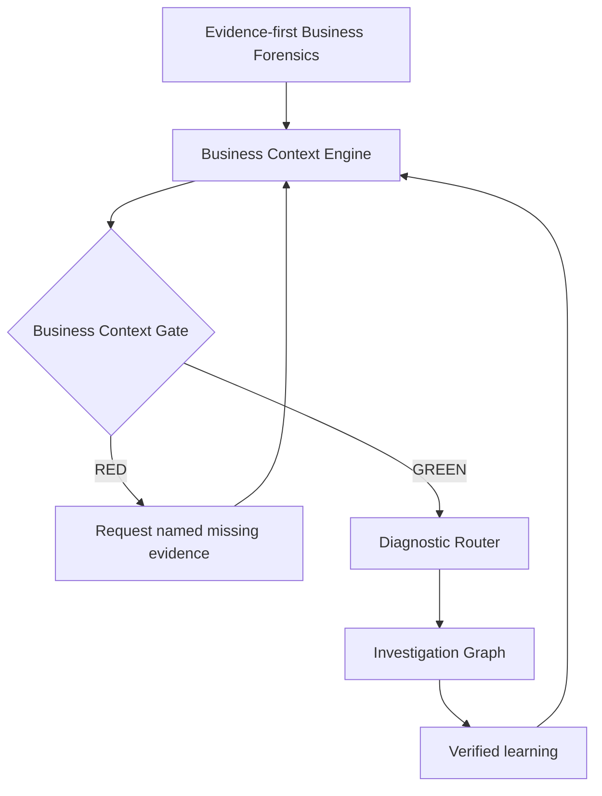
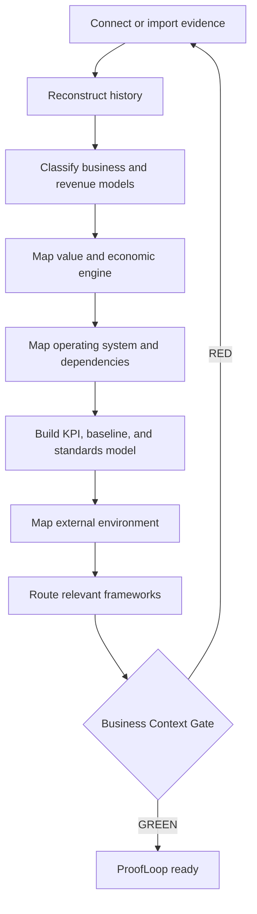
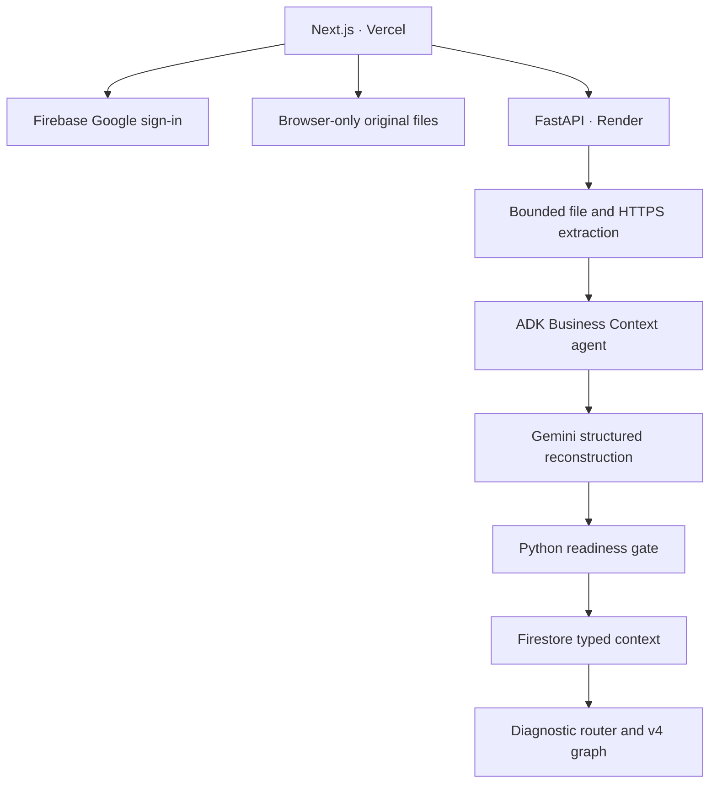
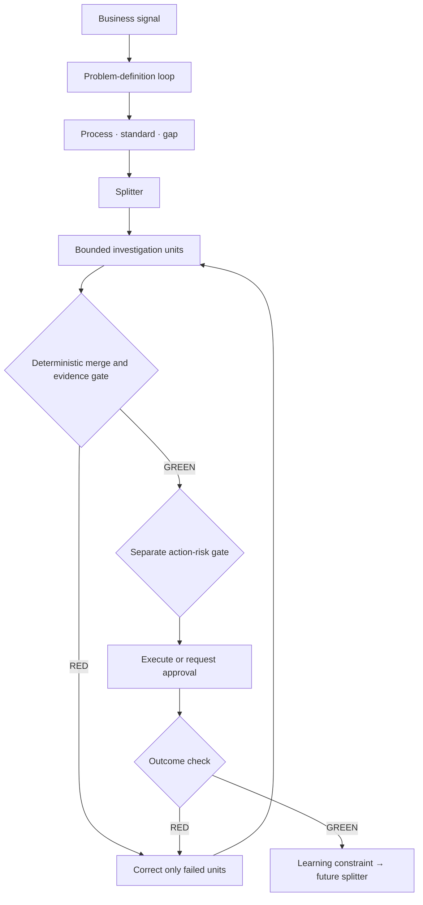
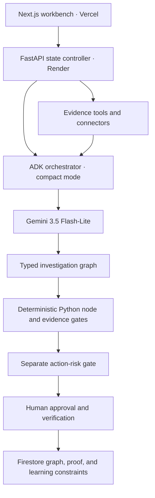

# ProofLoop context and investigation-graph architecture

ProofLoop is an autonomous what-to-do-next investigation engine. It does not stop at
finding an anomaly or producing advice. It maintains a falsifiable investigation
until programmatic checks turn every required unit GREEN, then passes a separate
risk gate, verifies the result, and turns the outcome into a constraint that
changes future investigations.

The investigation graph is preceded by a **Business Context Engine**. ProofLoop
first reconstructs how the business creates value, earns revenue, operates, and
normally behaves. This keeps the diagnostic agent from treating an isolated
metric, a generic benchmark, or the solopreneur's first interpretation as ground
truth.

## Product topology



The two major layers have different responsibilities:

| Layer | Responsibility | Primary output |
|---|---|---|
| Business Context Engine | Reconstruct what the business is, how it works, what normal looks like, and where evidence lives | Versioned `BusinessContextGraph` |
| Investigation Engine | Explain a specific consequential gap through bounded RED/GREEN loops | Auditable `DiagnosticDecision` |

The learning edge closes both loops. A verified intervention updates an
operating standard, baseline annotation, or routing constraint in the Business
Context Graph as well as the future investigation splitter.

## Evidence-first Business Forensics

ProofLoop asks where the business lives before asking the founder to explain
what is wrong. The target connector map includes:

| Evidence domain | Example sources |
|---|---|
| Business | Website, pitch deck, business plan, pricing, product documentation, strategy documents |
| Revenue | Stripe, Shopify, Amazon, Gumroad, Lemon Squeezy, QuickBooks, accounting exports |
| Product | PostHog, GA4, Mixpanel, Amplitude, application data, app-store analytics |
| Growth | Google Ads, Meta Ads, TikTok Ads, AppsFlyer, Search Console, email platforms |
| Customers | CRM, support, email, reviews, surveys, NPS, interviews |
| Operations | Notion, Linear, GitHub, project history, fulfillment, inventory, workflow tools |

Every connected or imported item becomes an evidence source with provenance,
freshness, permissions, coverage period, reliability, and the claims derived
from it. A connector being technically available never makes the Business
Context Gate GREEN by itself.

## Business-context reconstruction loop



This is an agentic reconstruction, not a long questionnaire. The founder reviews
material inferences, resolves contradictions, and supplies only missing facts
that would change the business model, expected standard, or diagnostic routing.

## Business Context Graph contract

The context graph is versioned and evidence-linked:

```text
BusinessContextGraph
├── identity
│   └── value proposition · customers · stage · objectives
├── classification
│   └── primary model · secondary models · revenue models
├── economic_engine
│   └── ordered value stages · conversion edges · economic constraints
├── operating_system
│   └── acquisition · product · revenue · customer · delivery · operations
├── dependencies
│   └── suppliers · platforms · processors · contractors · external services
├── evidence_map
│   └── source · provenance · permissions · freshness · coverage · reliability
├── kpi_tree
│   └── metric definition · source · owner · objective relationship
├── baselines[]
│   └── expected range · basis · period · confidence · volatility · seasonality
├── standards[]
│   └── value or range · standard type · evidence · strength · owner
├── causal_timeline
│   └── metric changes · releases · campaigns · pricing · suppliers · external events
├── external_environment
├── selected_frameworks
│   └── framework · trigger evidence · diagnostic purpose · exclusions
└── readiness
    └── status · sufficient fields · missing evidence · limitations
```

The graph records claims and uncertainty separately. Founder confirmation does
not erase the evidence basis; it is stored as an additional explicit source.

## Historical causal timeline

ProofLoop reconstructs trajectory, not merely current values. For each important
metric it attempts to derive:

- historical range and stable periods;
- current and prior baselines;
- trend, volatility, and seasonality when data coverage is sufficient;
- statistically or operationally meaningful change points;
- known interventions, releases, campaigns, pricing changes, supplier changes,
  platform changes, and major customer or external events;
- correlations worth testing without presenting them as causes.

Each timeline relationship is labelled `observed`, `correlated`, `supported`, or
`intervention_validated`. The timeline never upgrades temporal proximity into a
causal claim by itself.

## Standard hierarchy

The agent selects the strongest applicable standard and names its basis:

| Priority | Standard type | Example |
|---:|---|---|
| 1 | Explicit founder standard | Target conversion is 8% |
| 2 | Contractual or operational standard | Supplier SLA is 48 hours |
| 3 | Historical stable baseline | Median conversion was 7.4% in the prior stable period |
| 4 | Business-plan target | Planned CAC is below $45 |
| 5 | Credible external benchmark | Applicable peer benchmark with cited scope and source |
| 6 | Unknown | No defensible standard exists |

External benchmarks are never silent substitutes for missing business history.
Every expected value includes its standard type, evidence reference, applicable
period and segment, and strength. `Unknown` is a valid result.

Baseline readiness degrades gracefully:

| Level | Available evidence | Agent behavior |
|---|---|---|
| A | Rich historical data | Learn a stable evidence-backed baseline |
| B | Limited historical data | Mark a provisional baseline with low or medium confidence |
| C | No usable history | Use an explicit founder target and label its source |
| D | No history or target | Establish a measurement period; do not invent normal behavior |

## Business classification and economic engines

Classification supports hybrids instead of forcing one label. The minimum
contract includes `primary_model`, `secondary_models`, `revenue_models`, and
`stage`, with evidence and founder review state for each inference.

| Primary model | Default economic engine | Important constraints |
|---|---|---|
| Creator economy | Content → reach → audience → engagement → owned audience → monetization → retention | Audience concentration, channel dependency, revenue per audience member |
| Knowledge / expertise | Visibility → leads → qualification → proposal → close → delivery → client outcome → repeat/referral | Founder capacity, utilization, revenue per founder hour, concentration |
| Digital product | Traffic → discovery → intent → checkout → purchase → consumption → outcome → upsell/repeat | CAC, contribution margin, refunds, usage, support load |
| Solo ecommerce | Demand → traffic → product view → cart → checkout → payment → fulfillment → delivery → satisfaction → repeat | Supplier, inventory, processor, 3PL, carrier, marketplace dependencies |
| Micro-SaaS | Traffic → signup → activation → value event → paid conversion → engagement → retention → expansion/referral | Availability, errors, latency, releases, support, billing, usage limits |

ProofLoop may add, remove, or rename nodes when the evidence shows that the
actual business differs from a template. Templates seed reconstruction; they are
not conclusions.

## Framework Router

Frameworks are analytical lenses, not a mandatory sequence. The router selects
only the smallest set that can clarify the current business context or problem.

| Library group | Candidate lenses | Typical trigger |
|---|---|---|
| Build / validate | Lean Startup | High product-market uncertainty or experiment decisions |
| Growth / economics | AARRR, value pricing, time leverage, RFM, Rule of 40 where applicable | Funnel, monetization, retention, capacity, or unit-economics gap |
| Customer / service | SERVQUAL, Donabedian | Service experience, structure-process-outcome, or delivery-quality gap |
| Operations | Lean Six Sigma / DMAIC, OEE, SCOR | Process variation, equipment/capacity, or real supply-chain dependency |
| Strategic / external | Five Forces, PESTEL, SWOT synthesis, 7S, Balanced Scorecard | External or organization-wide evidence makes local execution insufficient |

Every selection stores the evidence that triggered it, the question it will
answer, and why nearby frameworks were excluded. Historical patterns can change
the route: rising revenue alongside faster-growing founder hours routes toward
time leverage and process capacity, while rising SaaS signups with falling
activation routes toward AARRR and product-funnel analysis.

## Business Context Gate

The gate asks one functional question:

> Does ProofLoop have enough context to distinguish normal business behavior
> from an anomaly and know where evidence for likely causes lives?

The gate evaluates, without making every field mandatory:

- business and revenue model clarity;
- customer and value-proposition clarity;
- a mapped primary economic engine and critical processes;
- defined primary KPIs and their sources;
- a baseline, explicit target, or transparent measurement plan;
- known dependencies and applicable operating standards;
- a historical change timeline with explicit coverage limitations;
- sufficient evidence provenance and freshness for the requested diagnostic.

`GREEN` means context is sufficient for a particular diagnostic scope, not that
the entire business is perfectly documented. `RED` returns named missing
evidence and explains which downstream decision it blocks. The gate can be
GREEN for one problem domain and RED for another.

## Context-aware diagnostic routing

The Diagnostic Router receives both the current signal and a frozen version of
the Business Context Graph. It uses the economic engine, dependencies, timeline,
standards, and learned constraints to decide which bounded units to create. The
current four demo units—product, customer, growth, and operations—remain the
hackathon graph, while the target splitter can add finance, capacity, partner,
or external-environment units when the business context requires them.

The diagnostic record stores the context version used for the decision. Later
context changes never silently rewrite the evidence basis of an earlier proof.

## Confirmed v5 product experience

The public app opens on the ready Northstar Studio overview. Primary navigation
is `Overview · Business Forensics · Investigations · Proof Ledger`. A persistent
right-side agent panel accompanies the continuous journey:

`Evidence → History → Business model → Economic engine → Operations → Baselines → Readiness → Investigation`

The overview shows a chart-first historical timeline with a table toggle.
Selecting an event exposes its evidence, before/after metrics, Gemini-ranked
investigation leads, and a Create investigation action. The term *lead* is
deliberate: the diagnostic evidence gate must still validate a cause.

Personal onboarding combines evidence and chat. Real uploads and one public
HTTPS page may supply context; the adaptive agent asks one highest-information
question for remaining gaps. Material inferences stay pending until the founder
confirms or rejects them. For conflicting sources, Gemini provisionally selects
the most reliable claim, displays both claims and their provenance, and requires
founder approval.

The initial investigation splitter runs product, customer, growth, and
operations units. Context may add zero to three finance, capacity, partner, or
external-environment units. Frameworks modify questions and unit design but can
never replace deterministic ProofLoop evidence and action gates.

## v5 runtime and security contract



- The Northstar demo context is public and requires no account.
- Personal context routes verify Firebase ID tokens server-side.
- Supported uploads are PDF, CSV, XLSX, TXT, Markdown, DOCX, and PPTX, limited
  to 10 MB each and 45,000 extracted characters per source.
- Upload bytes are discarded after extraction. Original files are retained only
  in the user's browser using IndexedDB.
- URL ingestion accepts final public HTTPS HTML or text pages, performs DNS and
  IP checks, rejects redirects and non-public address classes, and limits size.
- Firestore adds `business_contexts`, `context_messages`, and
  `evidence_sources` to the diagnostic and proof collections.

## Four structural primitives

| Primitive | Responsibility |
|---|---|
| Graph | Determines how the investigation moves and which units depend on others |
| Loop | Makes one bounded unit correct through produce → check → correct → repeat |
| Gate | Programmatically determines whether the graph can continue |
| Learning edge | Converts a verified outcome into a constraint for the next splitter |

`GREEN` does not mean a hypothesis is true. It means the unit reached a valid
conclusion. A hypothesis can be `rejected` and its unit can be GREEN. `RED`
means the unit itself is incomplete, inconclusive, or missing blocking evidence.

## Canonical decision loop



The diagnostic backbone is:

`Problem → Process → Step → Standard → Gap → Split → Unit loops → Merge → Evidence gate → Risk gate → Action → Outcome loop → Learning edge`

## Runtime architecture



The hosted path uses one schema-constrained ADK orchestrator call. This follows
the architecture of one orchestrator plus deterministic state transitions and
specialized tools; it avoids a fragile swarm of agents. The six-agent sequential
workflow remains available as an evaluation mode, not the primary production
path.

## Investigation state contract

Every run stores:

```text
Incident
├── 5W1H frame and business impact
├── problem_gate
│   └── metric · expected · observed · delta · segment
│       timeframe · source · reproducible · RED/GREEN
├── process_gap
│   ├── process
│   ├── failing_step
│   ├── expected_standard
│   ├── actual_execution
│   └── gap
├── five_whys[]
├── system_factors[]
│   └── people · process · technology · inputs
│       environment · measurement · incentives
├── ownership
│   └── technical · operational · execution · quality · approver
├── quality_escape and incentive_alignment
├── investigation_graph
│   ├── core units[product, customer, growth, operations]
│   ├── optional units[finance, capacity, partner, external]
│   │   └── produce · check · status · attempts · evidence
│   └── edges[dependency, correction, learning]
├── hypotheses[]
│   └── mechanism · supporting/contradicting evidence
│       missing evidence · discriminating test · evidence state
├── root_problem
├── root_cause_evidence_gate
├── action_risk_gate
├── intervention and locked measurement contract
└── investigation termination state
```

The three operating comparisons are explicit:

| Contract | Question |
|---|---|
| Standard | What should have happened? |
| Evidence | What actually happened? |
| Verification | How will correctness be proven? |

## State machine and stopping rules

Pre-action termination states:

| State | Meaning | Allowed transition |
|---|---|---|
| `confirmed` | A supported, controllable cause passed the proof gate | Request human approval |
| `insufficient_evidence` | Important evidence is absent | Gather a named missing observation |
| `conflicting_evidence` | Credible hypotheses cannot be separated | Run the cheapest discriminating test |

After intervention, `intervention_validated` is allowed only when the predicted
metric moves in the predicted direction and guardrails pass.

The Python service independently enforces:

- at least two independent evidence sources;
- three to five materially different hypotheses;
- at least one supported hypothesis;
- a supported Root Problem Record;
- a reproducible problem definition with a computable delta;
- exactly one product, customer, growth, and operations core unit, with no more
  than three unique context-triggered optional units;
- each GREEN unit has a supported or rejected verdict, cited evidence, no
  blocking missing evidence, and remains within its retry budget;
- only RED units are returned for correction;
- action controls match blast radius and reversibility;
- a human-approval requirement before action;
- maximum four investigation rounds, twenty tool calls, and five hypotheses.

Gemini may recommend a transition, but it cannot bypass this gate.

## Operating-system diagnosis

ProofLoop looks beyond software symptoms across seven modern business factors:

| Domain | Examples |
|---|---|
| People | Skills, capacity, training, communication |
| Process | Workflow, handoffs, SOPs, approvals |
| Technology | Software, APIs, infrastructure, automation |
| Inputs | Data, traffic, requirements, customer mix |
| Environment | Market, regulation, competition, operating conditions |
| Measurement | Instrumentation, definitions, reporting quality |
| Incentives | KPIs, speed/quality tradeoffs, performance pressure |

Ownership is separated into technical owner, operational owner, executor,
quality owner, and decision approver. This lets the system detect missing
accountability, responsibility without authority, and unowned quality controls.

## Closure and organizational memory

The intervention contract is locked before approval: scope, reversibility,
primary metric, success threshold, observation window, guardrails, and stop
condition. Evaluation writes the outcome plus a standardization record:

`Incident → Cause → Action → Outcome → Derived constraint → Future splitter`

The correction edge repairs only the current failed unit. The learning edge is
different: it stores `lesson`, `derived_constraint`, `applies_when`, and
`future_splitter_effect`, then changes which units future incidents prioritize.

Firestore collections:

- `diagnostic_runs`: evidence, investigation state, hypotheses, and decision;
- `interventions`: scoped human authorization and idempotency record;
- `proof_records`: measured outcome, learned rule, updated control, and recurrence monitor.

## Safety and failure boundaries

- The initial signal is never called the root problem.
- Unsupported standards, owners, incentives, or causal links are marked unknown.
- Evidence-state labels replace arbitrary confidence percentages.
- Gemini capacity errors return retryable `503` responses; the system does not fabricate a diagnosis.
- Invalid structured output fails closed.
- Consequential actions require human approval.
- Credentials remain in runtime secrets and never enter prompts or repository state.

## Hackathon scope

The architecture understands broader organizational causes, but the demo proves
one end-to-end revenue incident using synthetic Google Ads-, Looker-, release-,
quality-, and customer-voice-shaped evidence. The judge-facing proof is the full
loop: diagnose the actual process failure, approve a bounded rollback, verify the
metric recovery, update the release standard, and persist the learned rule.
